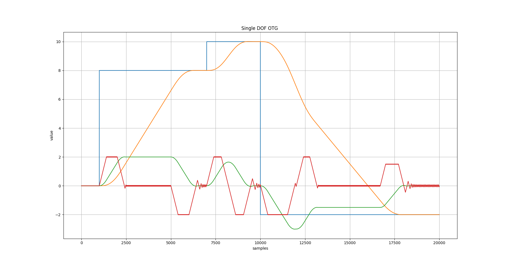

# 🎼 Chorus

     

**Chorus** is a high-performance **Multi-DOF Online Trajectory Generator** designed for robotic applications that demand real-time, smooth, and synchronized motion planning — all while respecting system constraints. With built-in jerk limiting and trajectory tracking, Chorus delivers optimal motion profiles with ultra-low latency.

---

## ✨ Features

- 🧠 **Real-Time Online Generation**  
  Generates smooth, optimal trajectories on the fly for any number of degrees of freedom.

- ⏱️ **Fast Execution**  
  Optimized for real-time performance — computation time is **under 3 milliseconds**.

- 🔄 **Dynamic Target Updates**  
  Targets and constraints can be updated **during motion** without stopping the system.

- 📉 **Jerk-Limited Profiles**  
  Ensures continuous motion by limiting jerk, making trajectories smoother and safer for hardware.

- 🛠️ **Constraint-Aware Planning**  
  Respects user-defined limits on position, velocity, acceleration, and jerk.

- 🎯 **Synchronized Multi-DOF Motion**  
  All degrees of freedom are synchronized for coordinated and collision-free movement.

- 🚀 **Integrated Tracking Controller**  
  Includes a responsive trajectory tracking controller for **high tracking accuracy**.

---
## Sample profile for a 1 DOF system


---
## 🛠️ Getting Started

### ✅ Basic Setup Example (Crucial Initialization)

- Here we will see what are the requried objects that we need to make and what functions to call in order to use Chorus

```.cpp
// setting up Chorus — these are mandatory steps!
Chorus::MultiDofOtg otg; // wrapper class over single dof otg
Chorus::MultiDofOTGOutput output; // output structure for multi dof otg
Chorus::OTGConstraints constraints; //constraints for all the dof (shared among all dof's)
Chorus::OTGTargetPosition target; // target position for all dof's
Chorus::SystemStates states; // system states as feedback
Chorus::MultiDofOTGControllerGains gains; // controller gains
int dof = 2; // number of dof in system

// Set DOF and resize
otg.setDof(dof); // sets the number of dof in the MultiDofOtg object
target.resize(dof); // mandatory resize
gains.resize(dof); // mandatory resize

// Controller gains (0 disables controller)
for (size_t i = 0; i < dof; i++) {
    gains[i].kp = 0;
    gains[i].kd = 0;
    gains[i].ki = 0;
    gains[i].upper_limit = 0;
    gains[i].lower_limit = 0;
}
otg.setGains(gains); // sets the gains for the controller

// Define motion constraints
constraints.sampling_rate = 0.001; // 1 kHz
constraints.max_velocity = 2.0; // rad/s
constraints.min_velocity = -2.0;
constraints.max_acceleration = 2.0; // rad/s^2
constraints.min_acceleration = -2.0;
constraints.max_jerk = 4.0; // rad/s^3
constraints.min_jerk = -4.0;

// Set initial state and target
states.initial_position = {0, 0}; // initial state of the system based on feedback from the system
target = {0, 0}; // target position for system

// First output call
otg.getOutput(output);

// Update current state of the system based on the feedback from the system (replace the terms in the initial_position vector by the values from the feedback from the system).
states.initial_position = {output[0].position, output[1].position};

// Update system with constraints, target, and state
otg.update(constraints, target, states); // udpates the required data for Chorus , should be called in loop in every iteration

```

- ##So now we know what are the required initializations required in order to use Chorus ,refer to the coded examples in the bin folder to see how to use Chorus in your project.

---

## Deep Dive into the Chorus objects and structures
### - These are the all the data sturctures that you will need in order to setup your system.

- Chorus::MultiDofOtg otg

```.cpp
Chorus::MultiDofOtg otg;
```

- This is a wrapper class over the single dof OTG object this class is used to handle multiple DOF's ,it has the controller and the responsiblity to maintain Synchronization among the set DOF's in the system

- Chorus::MultiDofOTGOutput output;

```.cpp
Chorus::MultiDofOTGOutput output;

// each index of output will have these fields
 struct OTGOutput {
        double position = 0;      ///< Current position
        double velocity = 0;      ///< Current velocity
        double acceleration = 0;  ///< Current acceleration
        double jerk = 0;          ///< Current jerk (control variable)
    };
```

- This is the vector of output structure that will have the output of position ,velocity ,acceleration ,jerk when the getTrajectory method is called with this sturcture pass to it.

- Chorus::OTGConstraints constraints

```.cpp
Chorus::OTGConstraints constraints;

struct OTGConstraints {
        double sampling_rate = 0;
        double max_velocity = 0;
        double max_acceleration = 0;
        double max_jerk = 0;
        double min_velocity = 0;
        double min_acceleration = 0;
        double min_jerk = 0;
    };
```

- This is the structure that hold the constraints that are shared among all the DOF's in the system.
- NOTE: the constraints should not be more than your systems max limits and these values are in rad/s for velocity and rad/s^2 for acceleration and rad/s^3 for jerk.
- These constraints are not you system constrainst but are the trajectory constraints that you want for the motion so use them accordingly.

- Chorus::OTGTargetPosition target

```.cpp
Chorus::OTGTargetPosition target;
```

- This is a vector that will hold the target positions

- Chorus::SystemStates states

```.cpp
Chorus::SystemStates states;

struct SystemStates {
        std::vector<double> initial_position;      ///< Initial positions for all DOFs
        std::vector<double> initial_velocity;      ///< Initial velocities for all DOFs
        std::vector<double> initial_acceleration;  ///< Initial accelerations for all DOFs
    };
```

- This is a vector of SystemStates structure and hold the current states of the system.
- For now use the initial_position term to be sent in feedback ,velocity and acceleration feedbacks are not being used by Chorus as of not ,they are here for just in case :).
- Each index of this vector will have the states of the corresponding DOF.

- NOTE: State feedback should be sent to Chorus in every control cycle.

- Chorus::MultiDofOTGControllerGains

```.cpp
Chorus::MultiDofOTGControllerGains gains;

// each index of gains will have this structure
 struct ControllerGains {
        double kp = 0;           ///< Proportional gain
        double kd = 0;           ///< Derivative gain
        double ki = 0;           ///< Integral gain
        double upper_limit = 0;  ///< Upper limit for control output
        double lower_limit = 0;  ///< Lower limit for control output
    };
```

- This vector of structure holds the gains for the controller.


---

## 🧩 Use Cases

- Industrial robot arms
- CNC machines
- Cobots in force-sensitive tasks
- Autonomous mobile robots
- Custom robotic platforms needing real-time planning

---

## 🚀 Getting Started

### Prerequisites

- C++17 or newer
- Eigen3
- CMake ≥ 3.10

### Build Instructions

```bash
git clone https://github.com/aadi753/Chorus.git
cd Chorus
mkdir build && cd build
cmake ..
make
```
